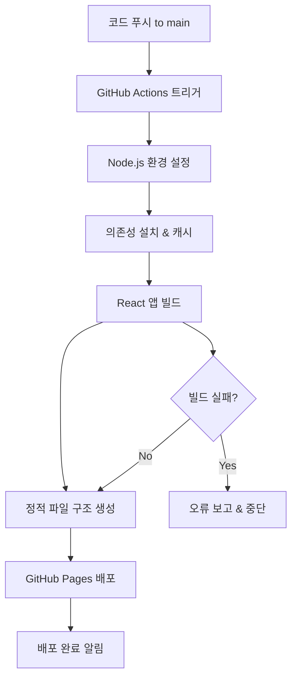

# 설계 문서

## 개요

MyZone React 앱을 GitHub Pages에 배포하여 사용자가 실제 서비스를 체험할 수 있도록 하는 시스템을 설계합니다. 기존 정적 HTML 랜딩 페이지와 React 앱을 모두 제공하는 하이브리드 구조로 구성하여, 프로젝트 소개와 실제 앱 체험을 모두 지원합니다.

## 아키텍처

### 전체 구조

```
GitHub Pages 사이트
├── / (루트) - 정적 HTML 랜딩 페이지
├── /app/* - React SPA 앱
└── /assets/ - 공통 리소스
```

### 배포 파이프라인



## 컴포넌트 및 인터페이스

### 1. 파일 구조 설계

**배포 후 GitHub Pages 구조:**
```
docs/ (GitHub Pages 소스)
├── index.html (랜딩 페이지)
├── app/
│   ├── index.html (React 앱 진입점)
│   ├── static/
│   │   ├── css/
│   │   ├── js/
│   │   └── media/
│   └── manifest.json
├── assets/
│   ├── images/
│   └── icons/
└── 404.html (SPA 라우팅 지원)
```

### 2. React 앱 라우팅 설정

**BrowserRouter 설정:**
- `basename="/myzone-mobile-activation/app"` 설정
- GitHub Pages 서브패스 지원
- SPA 라우팅을 위한 404.html 리다이렉트

### 3. 환경 설정 관리

**빌드 환경 변수:**
```bash
PUBLIC_URL=/myzone-mobile-activation/app
REACT_APP_API_URL=https://myzone-backend-production.up.railway.app/api/v1
REACT_APP_ENVIRONMENT=demo
REACT_APP_DEMO_MODE=true
GENERATE_SOURCEMAP=false
```

## 데이터 모델

### 1. 배포 설정 모델

```typescript
interface DeploymentConfig {
  publicUrl: string;
  apiUrl: string;
  environment: 'demo' | 'production';
  demoMode: boolean;
  sourcemap: boolean;
}
```

### 2. 라우팅 설정 모델

```typescript
interface RoutingConfig {
  basename: string;
  routes: {
    landing: '/';
    app: '/app';
    fallback: '/app';
  };
}
```

## 오류 처리

### 1. 빌드 오류 처리

**오류 유형별 대응:**
- **의존성 설치 실패:** 캐시 클리어 후 재시도
- **TypeScript 컴파일 오류:** 상세 오류 로그 출력
- **번들링 실패:** 메모리 부족 시 Node.js 옵션 조정
- **환경 변수 오류:** 필수 변수 검증 단계 추가

### 2. 런타임 오류 처리

**React 앱 오류 처리:**
- ErrorBoundary로 컴포넌트 오류 캐치
- API 호출 실패 시 목업 데이터 사용
- 네트워크 오류 시 오프라인 모드 안내

### 3. 라우팅 오류 처리

**SPA 라우팅 지원:**
- 404.html에서 React 앱으로 리다이렉트
- 잘못된 경로 접근 시 홈으로 이동
- 브라우저 새로고침 지원

## 테스트 전략

### 1. 빌드 테스트

**CI/CD 파이프라인 테스트:**
- 빌드 성공/실패 시나리오 테스트
- 다양한 환경 변수 조합 테스트
- 캐시 동작 검증

### 2. 배포 테스트

**GitHub Pages 배포 테스트:**
- 정적 파일 접근성 테스트
- React 앱 로딩 테스트
- 라우팅 동작 테스트

### 3. 기능 테스트

**사용자 시나리오 테스트:**
- 랜딩 페이지에서 React 앱 이동
- React 앱 내 페이지 네비게이션
- 데모 모드 기능 동작 확인

## 성능 최적화

### 1. 빌드 최적화

**빌드 시간 단축:**
- npm 캐시 활용
- 병렬 빌드 프로세스
- 불필요한 소스맵 제거

### 2. 런타임 최적화

**로딩 성능 개선:**
- 코드 스플리팅 (이미 구현됨)
- 이미지 최적화
- 번들 크기 최소화

### 3. 캐싱 전략

**브라우저 캐싱:**
- 정적 리소스 캐시 헤더 설정
- 버전 기반 캐시 무효화
- Service Worker 활용 (PWA)

## 보안 고려사항

### 1. 환경 변수 보안

**민감 정보 보호:**
- 클라이언트 노출 변수만 사용
- API 키 등 민감 정보 제외
- 데모 모드 명시적 표시

### 2. CORS 설정

**API 호출 보안:**
- 백엔드 CORS 설정 확인
- 허용된 도메인만 API 접근
- 에러 시 안전한 폴백

## 모니터링 및 로깅

### 1. 배포 모니터링

**GitHub Actions 모니터링:**
- 빌드 성공/실패 알림
- 배포 시간 추적
- 오류 로그 수집

### 2. 사용자 모니터링

**클라이언트 모니터링:**
- 페이지 로딩 시간 측정
- 오류 발생 추적
- 사용자 행동 분석 (익명)

## 배포 전략

### 1. 단계별 배포

**배포 순서:**
1. 기존 정적 HTML 백업
2. React 앱 빌드 및 테스트
3. 하이브리드 구조로 배포
4. 기능 검증 및 롤백 준비

### 2. 롤백 계획

**문제 발생 시 대응:**
- 이전 버전으로 즉시 롤백
- 오류 원인 분석 및 수정
- 재배포 전 충분한 테스트

## 유지보수 계획

### 1. 정기 업데이트

**의존성 관리:**
- 보안 업데이트 적용
- React 버전 업그레이드
- 성능 개선 사항 반영

### 2. 문서화

**운영 문서:**
- 배포 가이드 업데이트
- 트러블슈팅 가이드 작성
- 사용자 가이드 제공