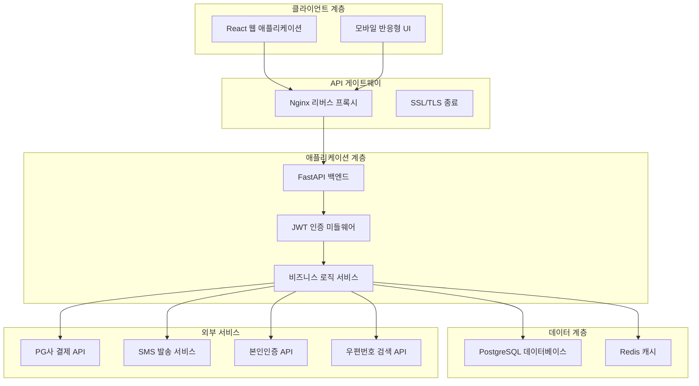
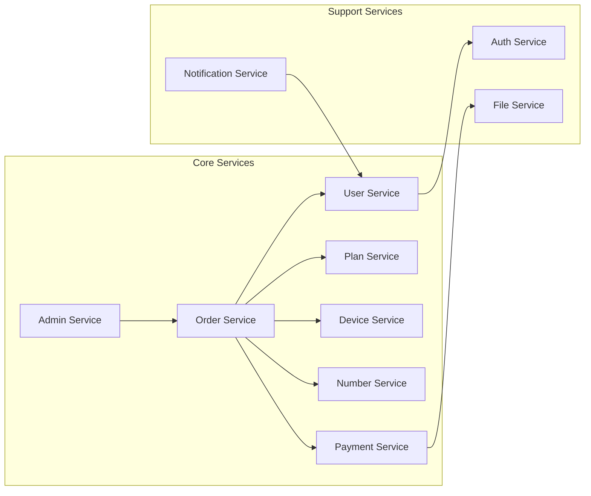
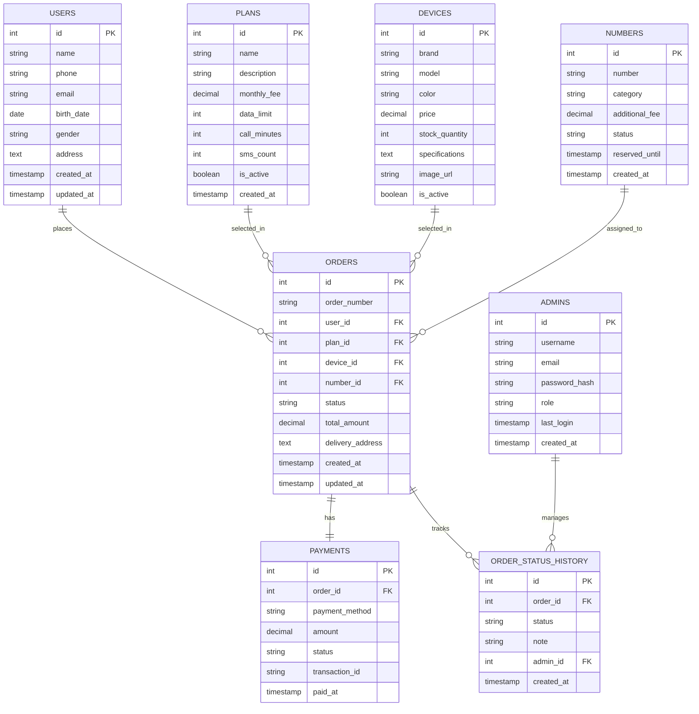

# 설계 문서

## 개요

MyZone 핸드폰 개통 서비스는 FastAPI 백엔드와 React 프론트엔드로 구성된 풀스택 웹 애플리케이션입니다. PostgreSQL 데이터베이스를 사용하며, 고객의 개통 신청부터 관리자의 처리까지 전체 워크플로우를 지원합니다. 보안, 성능, 사용자 경험을 중시하여 설계되었습니다.

## 아키텍처

### 전체 시스템 아키텍처



### 마이크로서비스 구조



## 컴포넌트 및 인터페이스

### 백엔드 컴포넌트

#### 1. API 라우터 구조
```
/api/v1/
├── auth/          # 인증 관련
├── plans/         # 요금제 관리
├── devices/       # 단말기 관리
├── numbers/       # 번호 관리
├── orders/        # 주문 관리
├── payments/      # 결제 처리
├── users/         # 사용자 관리
├── admin/         # 관리자 기능
├── notifications/ # 알림 서비스
└── support/       # 고객지원
```

#### 2. 서비스 레이어
- **UserService**: 사용자 정보 관리, 본인인증
- **PlanService**: 요금제 조회, 비교, 선택
- **DeviceService**: 단말기 관리, 재고 확인
- **NumberService**: 번호 검색, 예약, 관리
- **OrderService**: 주문 생성, 상태 관리, 워크플로우
- **PaymentService**: 결제 처리, PG사 연동
- **NotificationService**: SMS, 이메일 발송
- **AdminService**: 관리자 대시보드, 통계

#### 3. 리포지토리 패턴
```python
class BaseRepository:
    def create(self, entity: BaseModel) -> BaseModel
    def get_by_id(self, id: int) -> Optional[BaseModel]
    def update(self, id: int, data: dict) -> BaseModel
    def delete(self, id: int) -> bool
    def list(self, filters: dict, pagination: dict) -> List[BaseModel]
```

### 프론트엔드 컴포넌트

#### 1. 페이지 컴포넌트
```
src/pages/
├── HomePage/           # 메인 페이지
├── PlanSelectionPage/  # 요금제 선택
├── UserInfoPage/       # 개인정보 입력
├── DeviceSelectionPage/# 단말기 선택
├── NumberSelectionPage/# 번호 선택
├── OrderSummaryPage/   # 신청 내역 확인
├── PaymentPage/        # 결제
├── OrderStatusPage/    # 신청 현황 조회
├── AdminDashboard/     # 관리자 대시보드
└── SupportPage/        # 고객지원
```

#### 2. 공통 컴포넌트
```
src/components/
├── Layout/
│   ├── Header.tsx
│   ├── Footer.tsx
│   └── Sidebar.tsx
├── Forms/
│   ├── UserInfoForm.tsx
│   ├── AddressForm.tsx
│   └── PaymentForm.tsx
├── Cards/
│   ├── PlanCard.tsx
│   ├── DeviceCard.tsx
│   └── OrderCard.tsx
├── Common/
│   ├── Button.tsx
│   ├── Modal.tsx
│   ├── ProgressBar.tsx
│   └── LoadingSpinner.tsx
└── Charts/
    ├── OrderChart.tsx
    └── StatisticsChart.tsx
```

#### 3. 상태 관리 (Redux Toolkit)
```typescript
interface RootState {
  auth: AuthState;
  order: OrderState;
  plans: PlanState;
  devices: DeviceState;
  numbers: NumberState;
  ui: UIState;
}
```

## 데이터 모델

### 데이터베이스 스키마



### API 데이터 모델

#### 요청/응답 모델 (Pydantic)

```python
# 사용자 모델
class UserCreate(BaseModel):
    name: str
    phone: str
    email: EmailStr
    birth_date: date
    gender: str
    address: str

class UserResponse(BaseModel):
    id: int
    name: str
    phone: str
    email: str
    created_at: datetime

# 주문 모델
class OrderCreate(BaseModel):
    user_id: int
    plan_id: int
    device_id: int
    number_id: int
    delivery_address: str

class OrderResponse(BaseModel):
    id: int
    order_number: str
    status: str
    total_amount: Decimal
    user: UserResponse
    plan: PlanResponse
    device: DeviceResponse
    number: NumberResponse
    created_at: datetime

# 결제 모델
class PaymentCreate(BaseModel):
    order_id: int
    payment_method: str
    amount: Decimal

class PaymentResponse(BaseModel):
    id: int
    status: str
    transaction_id: str
    paid_at: datetime
```

## 오류 처리

### 오류 코드 체계

```python
class ErrorCode(Enum):
    # 인증 관련 (1000번대)
    UNAUTHORIZED = 1001
    INVALID_TOKEN = 1002
    TOKEN_EXPIRED = 1003
    
    # 사용자 관련 (2000번대)
    USER_NOT_FOUND = 2001
    INVALID_USER_DATA = 2002
    DUPLICATE_USER = 2003
    
    # 주문 관련 (3000번대)
    ORDER_NOT_FOUND = 3001
    INVALID_ORDER_STATUS = 3002
    ORDER_ALREADY_PAID = 3003
    
    # 결제 관련 (4000번대)
    PAYMENT_FAILED = 4001
    INVALID_PAYMENT_METHOD = 4002
    INSUFFICIENT_FUNDS = 4003
    
    # 시스템 관련 (5000번대)
    INTERNAL_SERVER_ERROR = 5001
    DATABASE_ERROR = 5002
    EXTERNAL_API_ERROR = 5003
```

### 전역 예외 처리기

```python
@app.exception_handler(ValidationError)
async def validation_exception_handler(request: Request, exc: ValidationError):
    return JSONResponse(
        status_code=422,
        content={
            "error_code": "VALIDATION_ERROR",
            "message": "입력 데이터가 올바르지 않습니다.",
            "details": exc.errors()
        }
    )

@app.exception_handler(HTTPException)
async def http_exception_handler(request: Request, exc: HTTPException):
    return JSONResponse(
        status_code=exc.status_code,
        content={
            "error_code": exc.detail.get("code", "HTTP_ERROR"),
            "message": exc.detail.get("message", "요청 처리 중 오류가 발생했습니다.")
        }
    )
```

### 프론트엔드 오류 처리

```typescript
// API 오류 처리
class ApiError extends Error {
  constructor(
    public status: number,
    public code: string,
    message: string,
    public details?: any
  ) {
    super(message);
  }
}

// 전역 오류 핸들러
const errorHandler = (error: ApiError) => {
  switch (error.code) {
    case 'UNAUTHORIZED':
      // 로그인 페이지로 리다이렉트
      break;
    case 'VALIDATION_ERROR':
      // 폼 검증 오류 표시
      break;
    default:
      // 일반 오류 토스트 표시
      showErrorToast(error.message);
  }
};
```

## 테스트 전략

### 백엔드 테스트

#### 1. 단위 테스트 (pytest)
```python
# 서비스 레이어 테스트
class TestUserService:
    def test_create_user_success(self):
        # Given
        user_data = UserCreate(name="홍길동", phone="010-1234-5678")
        
        # When
        result = user_service.create_user(user_data)
        
        # Then
        assert result.name == "홍길동"
        assert result.phone == "010-1234-5678"

# API 엔드포인트 테스트
class TestUserAPI:
    def test_create_user_endpoint(self, client):
        # Given
        user_data = {
            "name": "홍길동",
            "phone": "010-1234-5678",
            "email": "hong@example.com"
        }
        
        # When
        response = client.post("/api/v1/users/", json=user_data)
        
        # Then
        assert response.status_code == 201
        assert response.json()["name"] == "홍길동"
```

#### 2. 통합 테스트
```python
class TestOrderWorkflow:
    def test_complete_order_flow(self, client, db_session):
        # 1. 사용자 생성
        user = create_test_user()
        
        # 2. 요금제 선택
        plan = select_test_plan()
        
        # 3. 주문 생성
        order = create_test_order(user.id, plan.id)
        
        # 4. 결제 처리
        payment = process_test_payment(order.id)
        
        # 5. 주문 상태 확인
        assert order.status == "COMPLETED"
        assert payment.status == "SUCCESS"
```

### 프론트엔드 테스트

#### 1. 컴포넌트 테스트 (Jest + React Testing Library)
```typescript
describe('PlanCard', () => {
  test('요금제 정보를 올바르게 표시한다', () => {
    const plan = {
      name: '5G 프리미엄',
      monthlyFee: 55000,
      dataLimit: 'unlimited'
    };
    
    render(<PlanCard plan={plan} />);
    
    expect(screen.getByText('5G 프리미엄')).toBeInTheDocument();
    expect(screen.getByText('55,000원')).toBeInTheDocument();
  });
});
```

#### 2. E2E 테스트 (Playwright)
```typescript
test('전체 개통 신청 플로우', async ({ page }) => {
  // 1. 메인 페이지 접속
  await page.goto('/');
  await page.click('text=개통 신청');
  
  // 2. 요금제 선택
  await page.click('[data-testid="plan-premium"]');
  await page.click('text=다음');
  
  // 3. 개인정보 입력
  await page.fill('[name="name"]', '홍길동');
  await page.fill('[name="phone"]', '010-1234-5678');
  
  // 4. 결제 완료 확인
  await expect(page.locator('text=신청이 완료되었습니다')).toBeVisible();
});
```

## 보안 고려사항

### 1. 인증 및 인가
- JWT 토큰 기반 인증
- 토큰 만료 시간: 1시간 (액세스), 7일 (리프레시)
- Role-based Access Control (RBAC)

### 2. 데이터 보호
- 개인정보 AES-256 암호화
- 비밀번호 bcrypt 해싱
- HTTPS 강제 적용
- CORS 정책 설정

### 3. API 보안
- Rate Limiting (분당 100회)
- SQL Injection 방지
- XSS 방지 (CSP 헤더)
- CSRF 토큰 적용

### 4. 결제 보안
- PCI DSS 준수
- 카드 정보 토큰화
- 결제 데이터 암호화 전송

## 성능 최적화

### 1. 데이터베이스 최적화
- 인덱스 최적화
- 쿼리 성능 모니터링
- 커넥션 풀링
- 읽기 전용 복제본 활용

### 2. 캐싱 전략
- Redis를 통한 세션 캐시
- 요금제/단말기 정보 캐싱
- API 응답 캐싱 (TTL: 5분)

### 3. 프론트엔드 최적화
- 코드 스플리팅
- 이미지 최적화 (WebP)
- CDN 활용
- 서비스 워커 캐싱

### 4. 모니터링
- APM 도구 (New Relic/DataDog)
- 로그 집계 (ELK Stack)
- 메트릭 수집 (Prometheus)
- 알림 시스템 (Slack/Email)

## 배포 및 인프라

### 1. 컨테이너화
```dockerfile
# FastAPI 백엔드
FROM python:3.11-slim
WORKDIR /app
COPY requirements.txt .
RUN pip install -r requirements.txt
COPY . .
CMD ["uvicorn", "main:app", "--host", "0.0.0.0", "--port", "8000"]

# React 프론트엔드
FROM node:18-alpine
WORKDIR /app
COPY package*.json ./
RUN npm ci --only=production
COPY . .
RUN npm run build
CMD ["npm", "start"]
```

### 2. 오케스트레이션 (Docker Compose)
```yaml
version: '3.8'
services:
  backend:
    build: ./backend
    ports:
      - "8000:8000"
    environment:
      - DATABASE_URL=postgresql://user:pass@db:5432/myzone
    depends_on:
      - db
      - redis
  
  frontend:
    build: ./frontend
    ports:
      - "3000:3000"
    depends_on:
      - backend
  
  db:
    image: postgres:15
    environment:
      POSTGRES_DB: myzone
      POSTGRES_USER: user
      POSTGRES_PASSWORD: pass
    volumes:
      - postgres_data:/var/lib/postgresql/data
  
  redis:
    image: redis:7-alpine
    ports:
      - "6379:6379"
```

### 3. CI/CD 파이프라인
```yaml
# GitHub Actions
name: Deploy MyZone
on:
  push:
    branches: [main]

jobs:
  test:
    runs-on: ubuntu-latest
    steps:
      - uses: actions/checkout@v3
      - name: Run Tests
        run: |
          pytest backend/tests/
          npm test frontend/
  
  deploy:
    needs: test
    runs-on: ubuntu-latest
    steps:
      - name: Deploy to Production
        run: |
          docker-compose -f docker-compose.prod.yml up -d
```

이 설계 문서는 MyZone 핸드폰 개통 서비스의 전체적인 기술 아키텍처와 구현 방향을 제시합니다. FastAPI와 React를 기반으로 한 현대적인 웹 애플리케이션으로, 보안성과 확장성을 고려하여 설계되었습니다.